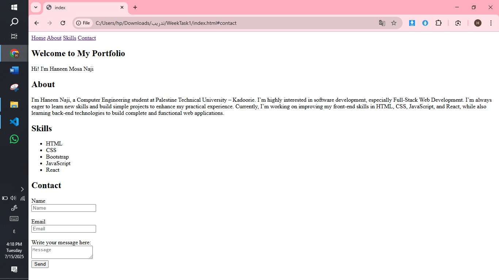

# Task Week 1

### Haneen Mosa naji 
### short description of the project
This project is the result of Week 1 training.  
It was created using only HTML.  
The page includes sections like Home, About Me, Skills, and a Contact Form.

### Summary of what you learned
- How to create a static website using only HTML.
- How to use Git and GitHub to manage and share code.
- How to organize project structure and write a good README.

